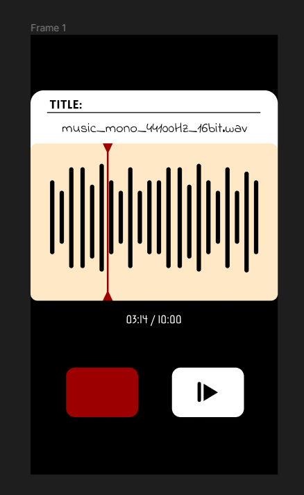
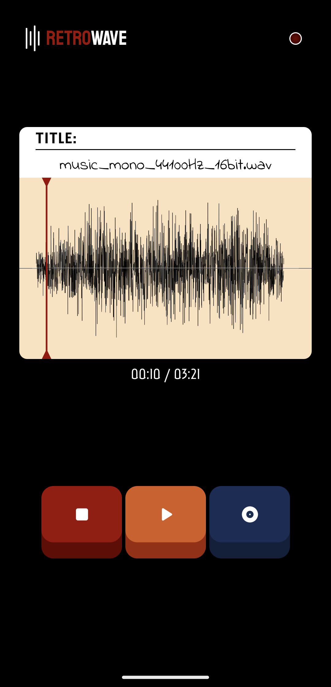
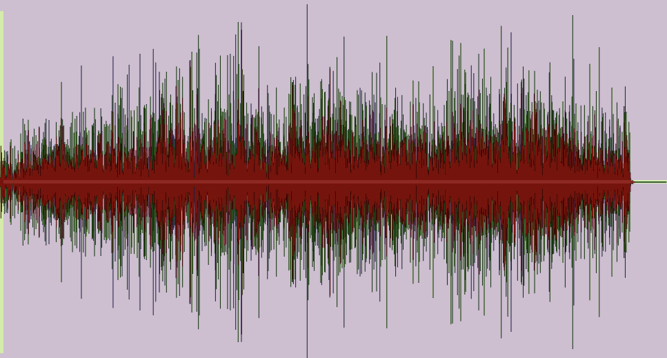
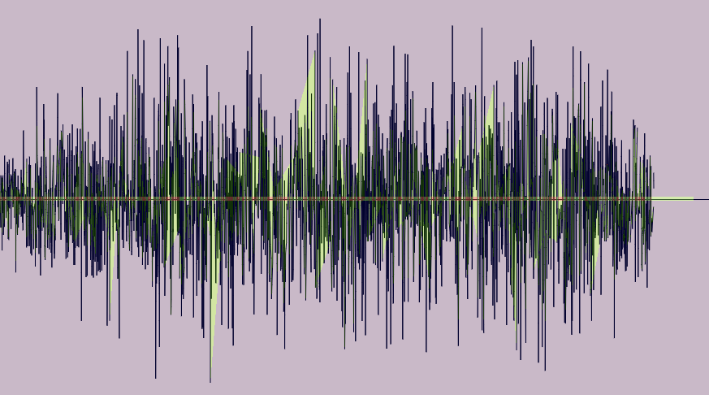

# Retrowave - A Retro-Themed WAV Waveform Visualizer
 ___A simple waveform visualizer.___


## Quick Overview:
- [Design Concept](#design-concept)
- [User Interface](#user-interface)
- [Waveform](#waveform)
- [Architechture](#architecture)
- [Animations](#animations)
- [Additional Features](#additional-features)
- [Known Bugs](#known-bugs)
- [Credits](#credits)

## Design Concept
The UI design is mostly inspired by the Google Recorder app and some old cassette tape players. I used Figma to do a quick sketch of the app. 




## User Interface
Now to the actual application design. It ended up mostly very similar to the base design concept, with some little detail changes:

### Application Overview


### Playback indicator: Lights up when audio is playing.


### Custom buttons: stop, play, change audio.


## Waveform
The basic implementation of the waveform analyzer draws points as circles on an interval and it draws a line that connects them.

Although this work on smaller files, it renders way too many points on larger files. It results in heavy computational time and results in cramped lines (since it's trying to fit all of the points into the width of the screen.) In simple terms, we could imagine this as we're trying to render 4k images on a full HD screen. A couple of changes:

- Introducing _step_ and _noise filter_ to the loop. With steps, we skip the n-step amount of index to reduce the density of the points that need to be drawn. The noise filter will skip low amplitude points since it'll be buried under higher amplitude samples.


```kotlin
    // step example: 
    for (i in 1 until waveForm.size step stepCount)

    // noise filter example:
    if (abs(waveform[i]) <= DEFAULT_SAMPLE_NOISES) continue
```

- Other than that, the circle drawing is removed since it does not fit the current theme. However, instead of drawing a straight line from a to b, the app draws a curved line between 2 points (x,y), with the middle point between them as the control point:
```kotlin
    val controlX1 = (prevX + x) / 2
    val controlY1 = (prevY + y) / 2
```
- Now, let's take a look at these 2 pictures:




When we use drawLine() to visualize the waveform, it does a lot of overdrawing on low-amplitude points. To solve this, we could use drawPath() instead. It reduces the UI jank tremendously, especially when the user interacts with the seekbar to change the audio current position.

## Architecture
Quick overview of the whole application layout:

        MainViewModel: Responsible for UI states, MediaPlayer states.
        Custom Views: Responsible for handling animations, UI looks, and appearance
        MainActivity: MainViewModel LiveData observers, View event listeners

The app is restructured  towards MVVM architectural pattern (or more like, VVM, since there's no real model implemented currently). It was done to solve a couple of problems:
- Preserve the state of the UI on configuration changes (ex. rotating the device causes the playback to stop)
- It's way easier and cleaner to implement dynamic values that need to be shown in the UI, by creating LiveData on viewmodel and letting the view observe them.
```kotlin
    // example of dynamic values
    private val _timestamp = MutableLiveData<Long>()
    // read-only form of LiveData
    val timestamp: LiveData<Long> get() = _timestamp

    /* we observe on View (MainActivity): */

    // observers
    mediaPlayerViewModel.timestamp.observe(this) { timestamp ->
        _binding.timestampTextView.text = getFormattedTime(timestamp)
    }
```
- At last, even after separating the logic to viewmodel, the main activity is already populated with lots of functions for event listeners and observers. It would be really hard to navigate through pretty quickly without restructuring the whole app.

## Animations!
If we play some audio while the app is muted, it doesn't look promising. To solve this, we introduce a couple of visual feedbacks for the user to _feel_ the audio just by looking at the app. Try the app to find out more about it! (_Looking at you, three-colored buttons._)

Other than that, there are new animation on how the waveform is drawn. Now it appears starting from left to right, instead of all at once.

### Technical Details
Currently, the app uses 3 different custom views, WaveformSlideBar, LayeredButtons, and PlaybackIndicator.

All of them extend an abstract class, CustomView which has 3 notable functions:

```kotlin
abstract render()
    Function to recalculate coordinates/sizes for the onDraw method to draw on the UI. 
    This function is called whenever the View detects size changes.

getAnimator(valueToAnimate: float)
    Just a pre-filled ObjectAnimator Constructor

abstract SetAnimator(animationValue: float)
    Add some manipulation to onDraw with animationValue, then invalidate
    animator.start() will call this
```

- For the waveform, setAnimator splits points to [last chunk index] :: [current animation value] and append them to a buffer Path() object, which will be drawn by onDraw later.

- For the buttons, the 3D effect comes from 2 rectangles with different heights. setAnimator will recalculate the position of the top rectangle (and icon) according to the current animation value.

- Unfortunately, the playback Indicator doesn't have any animations :(


## Additional Features

Some minor details of the app:
- Seekbar to re-position current audio playback   

    `Implemented with the provided seekbar with custom thumb and transparent progress`

- Dynamic title, timestamp, and total duration of the currently loaded audio

    `Data preserved in MainViewModel and observed by MainActivity`

- Flexible button press state

    `Button maximum height could be manipulated programmatically depending on the usage`
- Button animation when the user holds it and releases it. (ex: short press on the load button to loop through asset files, long press to open external media)

    `Implemented with OnTouchListener instead of OnClickListener, with some custom view animations`

## Known Bugs
Bugs to fix:
- MediaPlayer.currentPosition() sometimes emits descending value while playing audio. This caused the seekbar thumb moves backward when playing a very small audio duration. 

- Waveform does not render properly when the user rapidly changes the audio.

## Credits
EOF. You reached the end of the README. Thanks for reading!

This is a solution to the Paradox Cat coding challenge.

-Louise Malvin Tanaka :D