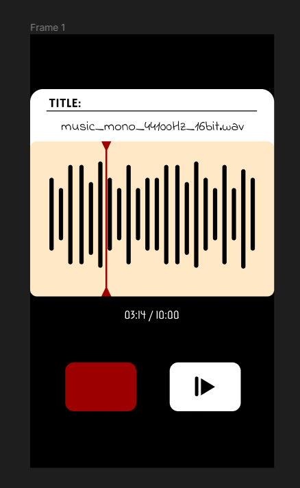

# Retrowave - A Retro-Themed WAV Waveform Visualizer
 ___A simple waveform visualiser.___


## Quick Overview:
- [User Interface](#ui)
- [Waveform Calculation](#waveform)
- [Architecture](#architecture)
- [Features](#features)
- [Credits](#credits)

## UI
The UI design is mostly inspired by google recorder app and old-cassete player. I used Figma to do a quick sketch of the app. 


## Waveform
The basic implementation of the waveform analyzer draws points as circles on an interval and it draws line that connects them to one another. 

Although this work on smaller files, it renders way too much points on larger files. It results on heavy computational time, and results a cramped up lines (since it's trying to fit all of the points into the width of the screen.) In simple terms, we could imagine this as we're trying to render 4k images on a full-hd screen. Couple of changes:

- Introducing _step_ to the loop. With step we skip n-step amount of index to reduce density of the points that needs to be drawn.

```kotlin
    for (i in 1 until waveForm.size step stepCount)
```

- Other than that, since the points are very close to each other, connections between 2 points becomes very hard to see and it start to form a filled-wave. We drop the circle drawing and changed line draw to a straight line from y to the middle.

```kotlin
    canvas?.drawLine(x, height / 2.0f, x, y, linePaint)
```

- When the line drawn very close to each others, it starts to look like a duplicate wave between + y axis and - y axis. Therefore, we could also add this to enhance the visual clarity.

```kotlin
    canvas?.drawLine(x, height - y, x, y, linePaint)
```

These changes could be fine-tuned further with some constants below:

```kotlin
    const val MIRROR_SAMPLES = true // draw y to -y to form a mirrorized wave
    const val LINE_WIDTH = 10.0f // adjust thickness of the line drawn
    const val DEFAULT_STEP_COUNT = 1500 // adjust step to skip
```

## Architecture
I restructured the app towards MVVM architectural pattern (or more like, VVM, since there's no model). I did it to solve a couple of problem:
- Preserve state of the UI (ex. rotating the device causes the playback to stop, re-opening the app breaks the waveform)
- It's way easier and cleaner to implement dynamic values that needs to be shown in the UI, by creating livedata on viewmodel and let the view observe them.
```kotlin
    // example of dynamic values
    private val _timestamp = MutableLiveData<Long>()
    // read-only form of LiveData
    val timestamp: LiveData<Long> get() = _timestamp
```
And we can observe on View (MainActivity):
```kotlin
    // observers
    mediaPlayerViewModel.timestamp.observe(this) { timestamp ->
        _binding.timestampTextView.text = getFormattedTime(timestamp)
    }
```

## Features
Additional features:


## Credits
EOF. You reached the end of the README. Thanks for reading!

This is a solution to the Paradox Cat coding challenge.

-Louise Malvin Tanaka :D